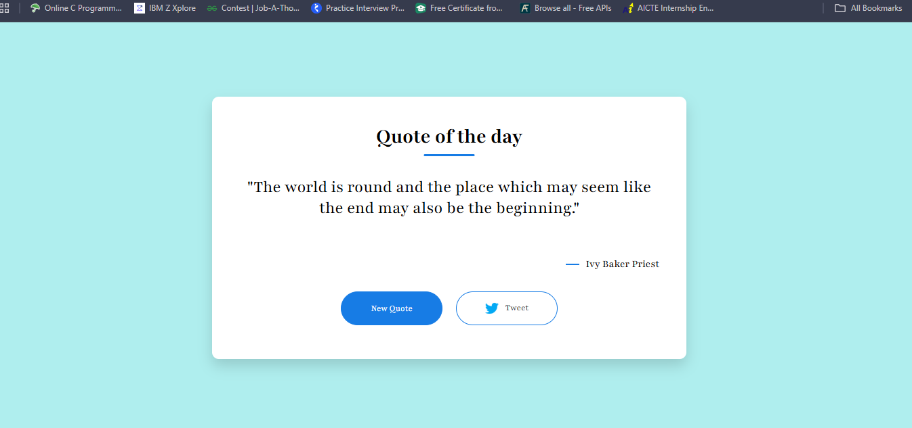
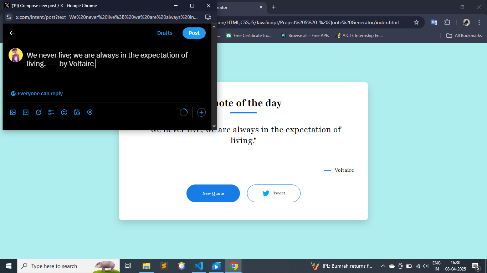

<h1 align="center">✨ Quote Generator ✨</h1>

  A sleek and simple random quote generator using <strong>HTML</strong>, <strong>CSS</strong> & <strong>JavaScript</strong>. 
  Powered by the <a href="https://api.quotable.io/">Quotable API</a>.

  

---

## 🚀 Features

✅ Fetches a **new random quote** on every click  
✅ Displays the **author** of the quote  
✅ Built using modern `async/await` syntax  
✅ Clean and minimal UI design  

---

## 🛠️ Technologies Used

- 🌐 HTML5  
- 🎨 CSS3  
- ⚡ JavaScript (ES6+)  
- 🌍 [Quotable API](https://api.quotable.io)

---

## 📸 Screenshot

> Save your screenshot as `screenshot.png` in the project folder

---

## 📂 Folder Structure

---

## 💻 How to Run Locally

1. Clone or download the repository  
2. Open `index.html` in your browser  
3. Click on **"New Quote"** to generate one!

---

## 🤝 Credits

- Quotes fetched from: [Quotable API](https://api.quotable.io)  
- Design inspired by minimalism ✨

---

## 📜 License

This project is free to use and share for learning purposes.  
Feel free to give credit if you find it helpful 😊

---

Made with 💙 using async/await

